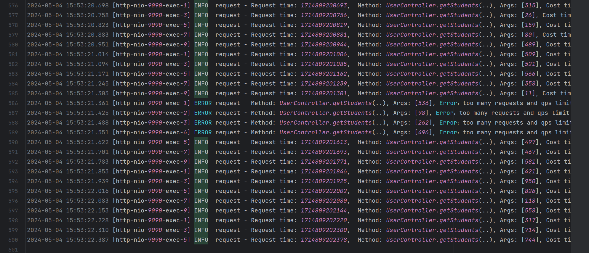
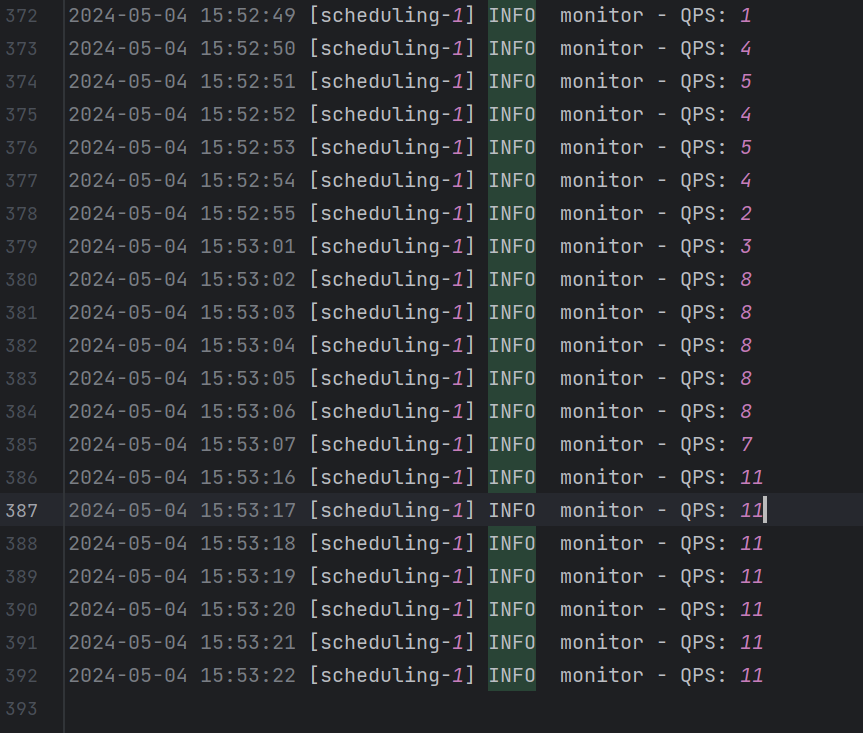

# API 课程作业3
21301141  杨东海

## 作业要求
**实现可审计的安全API设计**

分数：
满分100分（占总成绩20分）

截止时间：
2024年5月5日 24点

作业形式：
单人完成

作业内容：
设计并实现可审计的API安全接口

作业要求：

1. (10分)本地数据库创建（提交文件1：数据库SQL+Data）<br>
创建本地数据库，并创建一张Student表，有字段：id（主键），name，gender，age<br>
往数据库中随机生产10万条学生信息<br>
2. (70分)实现学生信息查询接口(SpingBoot、http接口，提交源代码、录屏)<br>
(20分)使用实现学生信息查询接口(http接口)，入参为1~1000的int值，返回相应数量的随机学生信息<br>
(10分) 入参异常值的接口自我保护<br>
(10分) 当前接口承接流量大小的监控（每秒多少条请求）<br>
(10分) 当前接口每条请求响应时间的监控（接口耗时），并分析不同qps下的性能<br>
(10分) 当前接口信息运行信息日志（包括系统+业务信息），统计各档位（1~1000入参分为10个档位）的平均耗时<br>
(10分) qps保护（即qps>10时，抛弃多余的请求）<br>
3. (20分) 实现批量curl请求的脚本 <br>
(10分) 能定制输入qps，按照相应设定值进行导流 <br>
(10分) 对接口返回成功率进行监控<br>
(10分bonus) 监控能用可视化的形式表现

作业目标
让学生将课堂学习的理论知识（第五章API安全），在实践中进行落地

作业红线：
不得抄袭！不得抄袭！不得抄袭！如发现抄袭行为，抄袭者和被抄袭者同时取消该次作业成绩
每迟交1周扣10分，5月19日24:00后提交成绩取消

## 作业报告
1. github地址
   https://github.com/Feniers/weChat_Easocen.git <br>
    分支：work3


2. 数据库SQL+Data

    /exSource/student.sql <BR>
   数据生成使用navicat自动生成十万条数据
```    
/*
Navicat Premium Data Transfer

Source Server         : Mysql
Source Server Type    : MySQL
Source Server Version : 80036
Source Host           : localhost:3306
Source Schema         : apiwork3

Target Server Type    : MySQL
Target Server Version : 80036
File Encoding         : 65001

Date: 04/05/2024 16:10:10
*/

SET NAMES utf8mb4;
SET FOREIGN_KEY_CHECKS = 0;

-- ----------------------------
-- Table structure for student
-- ----------------------------
DROP TABLE IF EXISTS `student`;
CREATE TABLE `student`  (
`id` int NOT NULL AUTO_INCREMENT,
`name` varchar(255) CHARACTER SET utf8mb4 COLLATE utf8mb4_0900_ai_ci NOT NULL,
`gender` int NOT NULL,
`age` int NOT NULL,
PRIMARY KEY (`id`) USING BTREE
) ENGINE = InnoDB AUTO_INCREMENT = 100001 CHARACTER SET = utf8mb4 COLLATE = utf8mb4_0900_ai_ci ROW_FORMAT = Dynamic;

-- ----------------------------
-- Records of student
-- ----------------------------
......
```


3. 接口异常值保护

    使用Validated进行入参检测，当入参不在1-1000范围内时，返回错误信息

    使用全局异常捕获控制异常信息返回，详情见
     src/main/java/com/example/apiwork3/exception/CommonExceptionHandler.java

4. 接口监控及日志信息

    本系统使用AOP进行接口监控及限流，记录qps和请求日志，详情见    src/main/java/com/example/apiwork3/aop/QpsMonitorAspect.java

    本系统使用logback进行日志记录，日志写入三个文件，见var/log，分别为：
     * 全局日志，all.log,记录系统日志
     * 请求日志，request.log ，输出详细日志，包括请求时间，线程id，线程名，方法名，参数，返回值，耗时，如果有异常的话的异常信息
        
     * qps检测日志,monitor.log，记录qps信息，包括时间，qps
        

5. 自动脚本

    脚本使用python编写，见/exSource/test_api.py
    
    运行结果见/exSource/output.txt
    
    结合qps监测与脚本成功率监测可知：
        
    限流效果良好，请求qps小于限制时，请求成功率为100%；请求qps大于限制时，成功率下降，超出的请求被按规则限制

    分别测试了限流10，请求为5，10，20等情况，均能正常限流，请求完成性能，即耗时没有明显变化


6. 作业录屏
    作业录屏见作业文件夹